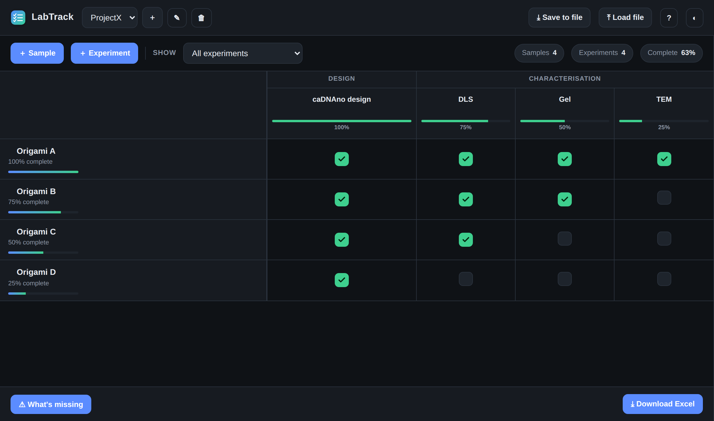
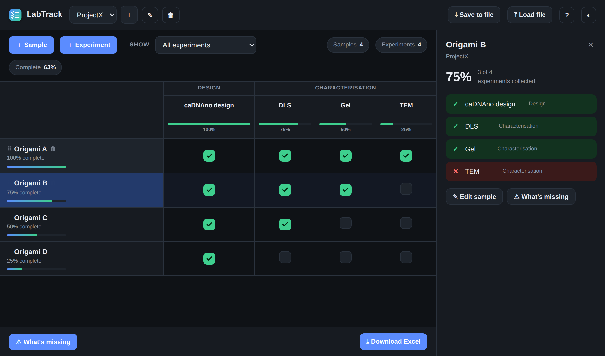
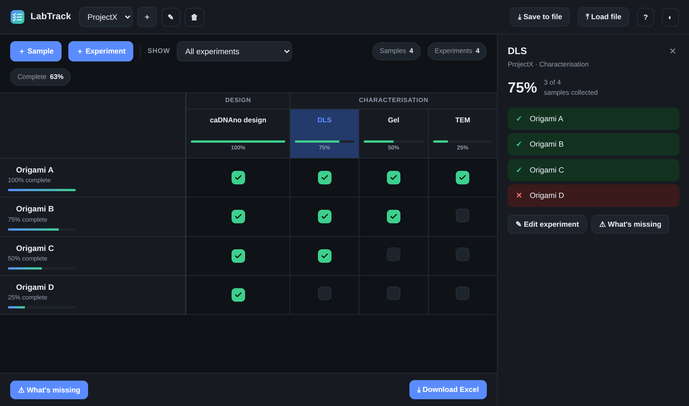
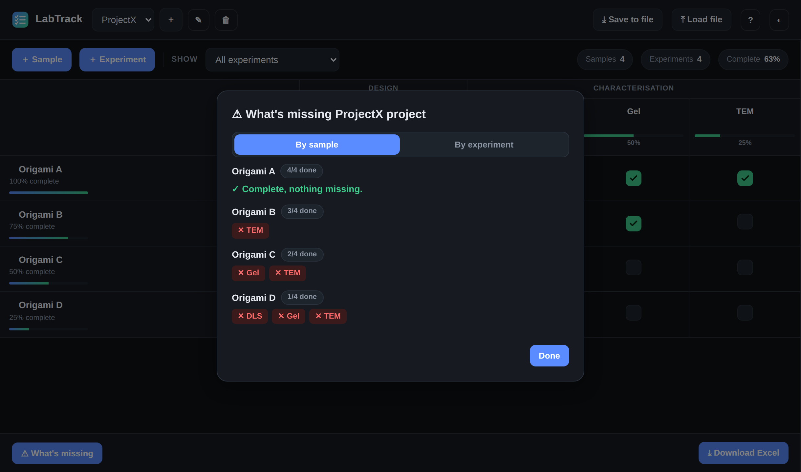

# LabTrack

**A lightweight, offline tool for tracking experimental progress across samples and experiments.**

-brightgreen)

---

## Overview

LabTrack keeps track of which experiments you have collected for each sample in a project. **Samples are rows, experiments are columns**, and you tick a box once the data for that combination is in hand. Progress bars update live for every sample and every experiment, so at any moment you can see what is finished and, just as importantly, what is still missing.

It was built for keeping an overview of characterisation work (for example on DNA-origami / nanostructure samples), where each construct needs to pass through several assays such as caDNAno design, DLS, gel electrophoresis and TEM, and it is easy to lose track of which sample still needs which measurement.

There is nothing to install and nothing to configure: LabTrack is a single HTML file that opens in any web browser and saves your data locally on your own computer.

## Features

- **Projects, samples and experiments:** organise multiple projects, each with its own samples (rows) and experiments (columns).
- **Experiment groups:** bundle related columns under a heading (e.g. *Characterisation*: DLS, Gel, TEM).
- **One-click tracking:** tick a cell when data is collected; per-sample and per-experiment progress bars update instantly.
- **Detail panels:** click any sample *or* any experiment to see, at a glance, what is done (green ✓) and what is missing (red ✕).
- **"What's missing" report:** a full overview with a *By sample* / *By experiment* toggle.
- **Excel export:** download a spreadsheet where `x` marks collected data and blank marks what is still needed.
- **Filtering and reordering:** show a single experiment or group, and drag sample rows to reorder them.
- **Local backup:** save all your data to a file you own, and load it back on any computer.
- **Light and dark themes.**

## Screenshots

Click any **sample** or any **experiment** to open a side panel showing what's done (✓) and what's still missing (✕):

| Click a sample | Click an experiment |
| --- | --- |
|  |  |

The **What's missing** report, switchable between *by sample* and *by experiment*:

## Getting started

1. **Download** `index.html` (or `LabTrack.html`) from this repository.
2. **Double-click** it, and it opens in your default web browser and runs immediately, offline.
3. Add an **experiment** (a column) and a **sample** (a row), then tick boxes as you collect data.

Optionally, make it feel like a desktop app with its own icon and window:

- **Chrome / Edge:** open the file, then menu, then *Install page as app*.
- **Safari** (macOS Sonoma or newer): open the file, then *File*, then *Add to Dock*.

## Your data stays with you

LabTrack runs entirely in your browser. **There is no server and no account.** Your entries are saved automatically on your own computer, and nothing is ever uploaded anywhere. Each person who uses LabTrack keeps their own private data on their own machine.

For a portable backup, use **Save to file** to download a `.json` copy of everything, and **Load file** to restore it later or move it to another computer.

## How it works

LabTrack is a single, self-contained HTML file written in plain HTML, CSS and vanilla JavaScript, with no frameworks, no build step and no dependencies. Data is stored in the browser's local storage and can be exported to a portable JSON file. The Excel export is generated in-browser with no external libraries. Because it is just one file, it works offline and can be run from disk, a shared drive, or a hosted link without modification.

## Citing LabTrack

If LabTrack is useful in your work, please cite it. This repository includes a [`CITATION.cff`](CITATION.cff) file, so GitHub will show a **"Cite this repository"** button with ready-made APA/BibTeX entries.

Suggested citation:

> Rottensteiner, A. (2026). *LabTrack: an experiment progress tracker* (Version 1.0) [Computer software]. https://github.com/AlexiaRott/LabTrack

## License

Released under the [MIT License](LICENSE) © 2026 Alexia Rottensteiner.
